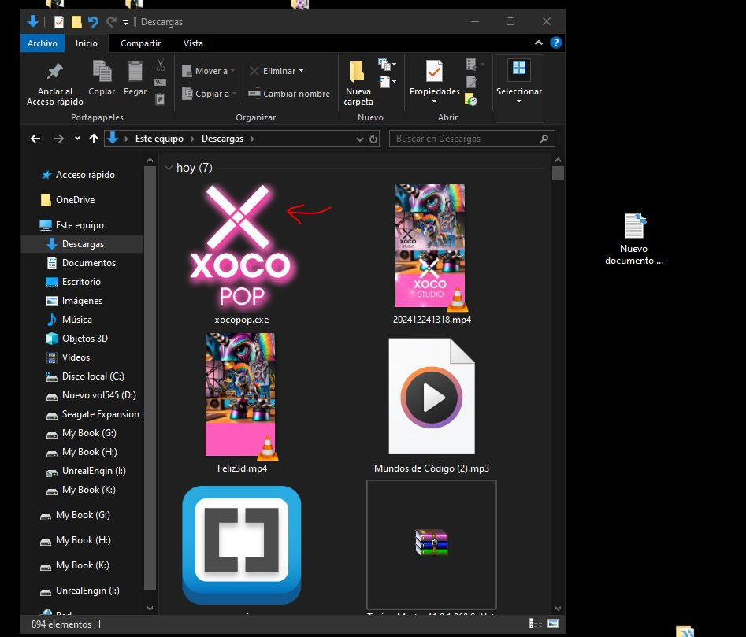
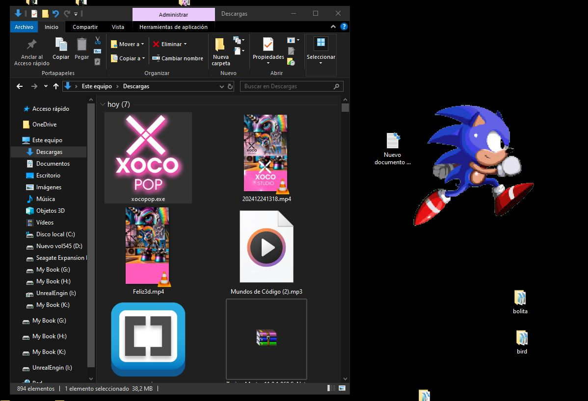

# Xocopop

Xocopop es una divertida aplicación desarrollada en Python. Presenta una ventana animada con un GIF personalizable y varias interacciones que permiten voltear, rotar y mover el GIF por la pantalla. Además, puede reproducir efectos de sonido para complementar la experiencia.

## Características
- **GIF animado** que se reproduce continuamente.
- **Interactividad total** mediante el teclado para mover, rotar, escalar y cambiar la opacidad de la ventana.
- **Efectos de sonido** que se reproducen al realizar ciertas acciones.
- **Ventana flotante y translúcida** que se mantiene siempre en la parte superior.
- **Soporte para atajos de teclado** para facilitar el control.

## Instalación y Ejecución
Descarga el ejecutable desde el siguiente enlace:
   [Descargar Xocopop](https://drive.google.com/file/d/1q1lgmIwxypFjV-_qQ5qzBmGg6HFnwtHo/view?usp=sharing)

## Uso

- **Mover la ventana:** Usa las teclas de dirección (Izquierda, Derecha, Arriba, Abajo)
- **Salto (Animación):** Barra espaciadora
- **Voltear Horizontalmente:** Ctrl + H
- **Voltear Verticalmente:** Ctrl + V
- **Rotar:** Teclas 4 (izquierda) y 6 (derecha)
- **Aumentar/Disminuir escala:** Teclas "+" o "-"
- **Ajustar opacidad:** Teclas 1 y 2
- **Aumentar velocidad del GIF:** Ctrl + Flecha Arriba
- **Disminuir velocidad del GIF:** Ctrl + Flecha Abajo
- **Cerrar la ventana:** Esc

### Animaciones y efectos adicionales
- **Tecla W/E:** Mover rápidamente hacia izquierda/derecha.
- **Teclas Q/A:** Saltar rápidamente hacia arriba/abajo.
- **Pausar/Reanudar animación:** Tecla End/Home

## Capturas de pantalla instalación

---

_Disfruta de Xocopop y dale vida a tu escritorio con animaciones interactivas y divertidas!_

## Descargo de Responsabilidad

**Importante:** El uso de este código es bajo total responsabilidad del usuario. ** Xocostudio** no se hace responsable por ningún tipo de mal uso, daño directo o indirecto, pérdida de datos, o cualquier otro perjuicio que pueda derivarse del uso de este software.

### Sin Garantías

El software se proporciona "tal cual", sin garantías de ningún tipo, ya sean expresas o implícitas. Esto incluye, pero no se limita a, las garantías de comerciabilidad, adecuación para un propósito particular y no infracción.

### Exención de Responsabilidad

Los autores no son responsables por cualquier reclamación, daño u otra responsabilidad que surja del uso del software, ya sea en una acción de contrato, agravio o de otra manera, que surja de, fuera de o en conexión con el software o el uso u otros tratos en el software.

### Uso del Código

Al descargar y utilizar este código, aceptas hacerlo bajo tu propio riesgo. Es tu responsabilidad asegurarte de que el software es adecuado para tus necesidades y de tomar todas las precauciones necesarias para evitar posibles daños o pérdidas.

Si tienes alguna pregunta o necesitas más información, por favor contacta a Xocostudio.

---

*¡Gracias por utilizar nuestro software! Asegúrate de leer y entender este descargo de responsabilidad antes de proceder.*

